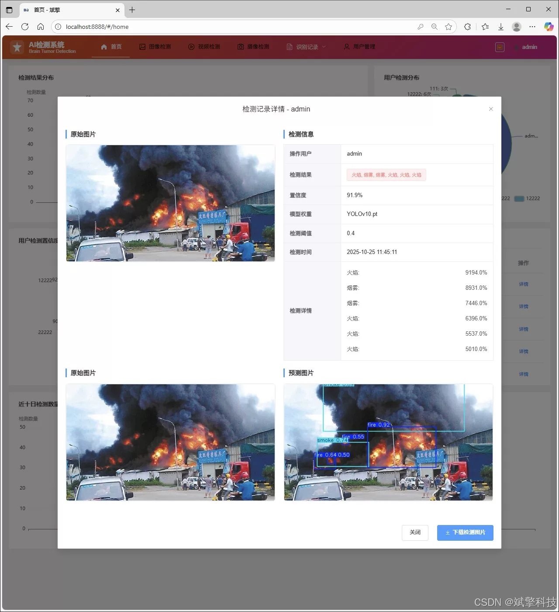
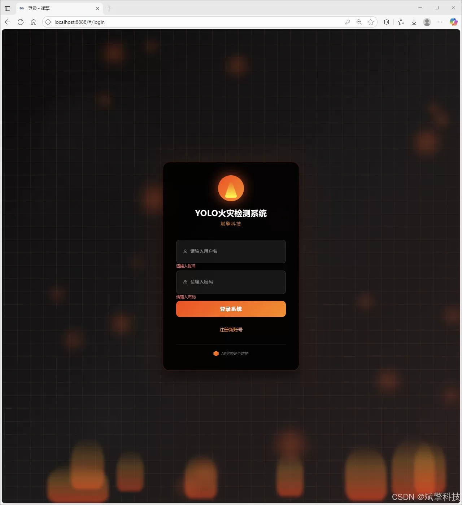
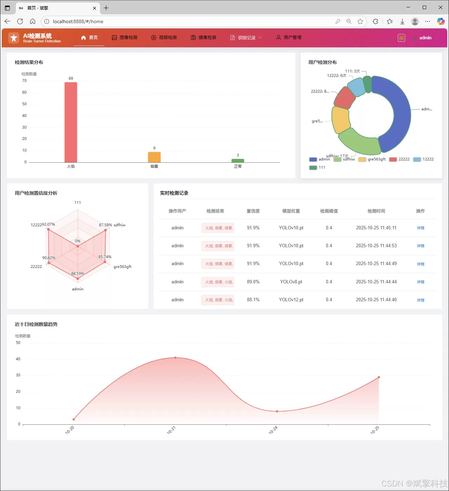
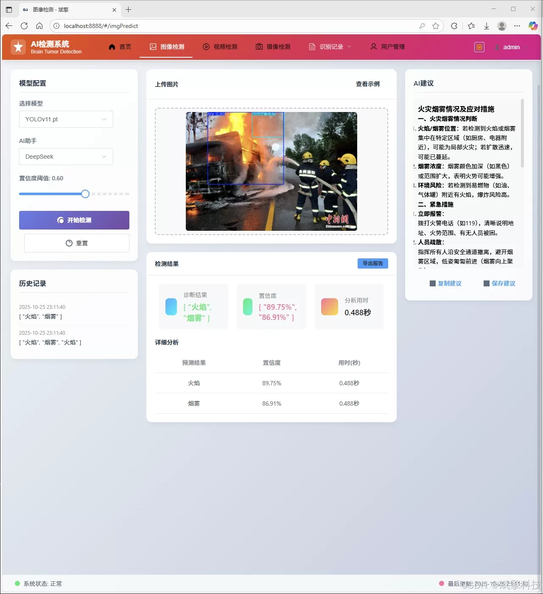
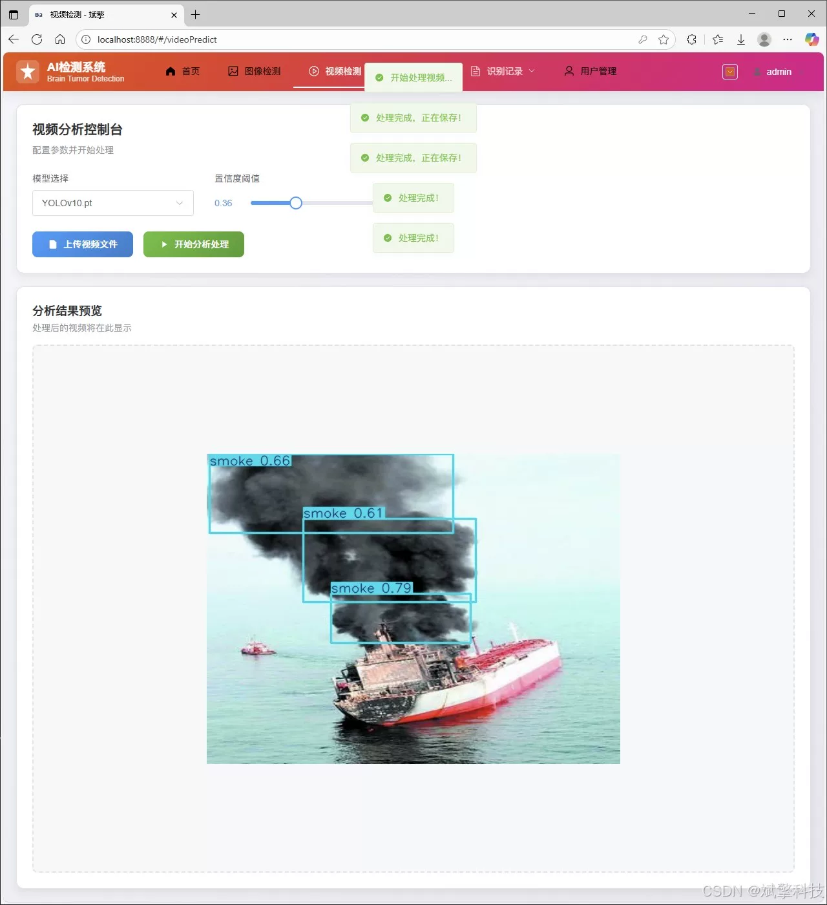
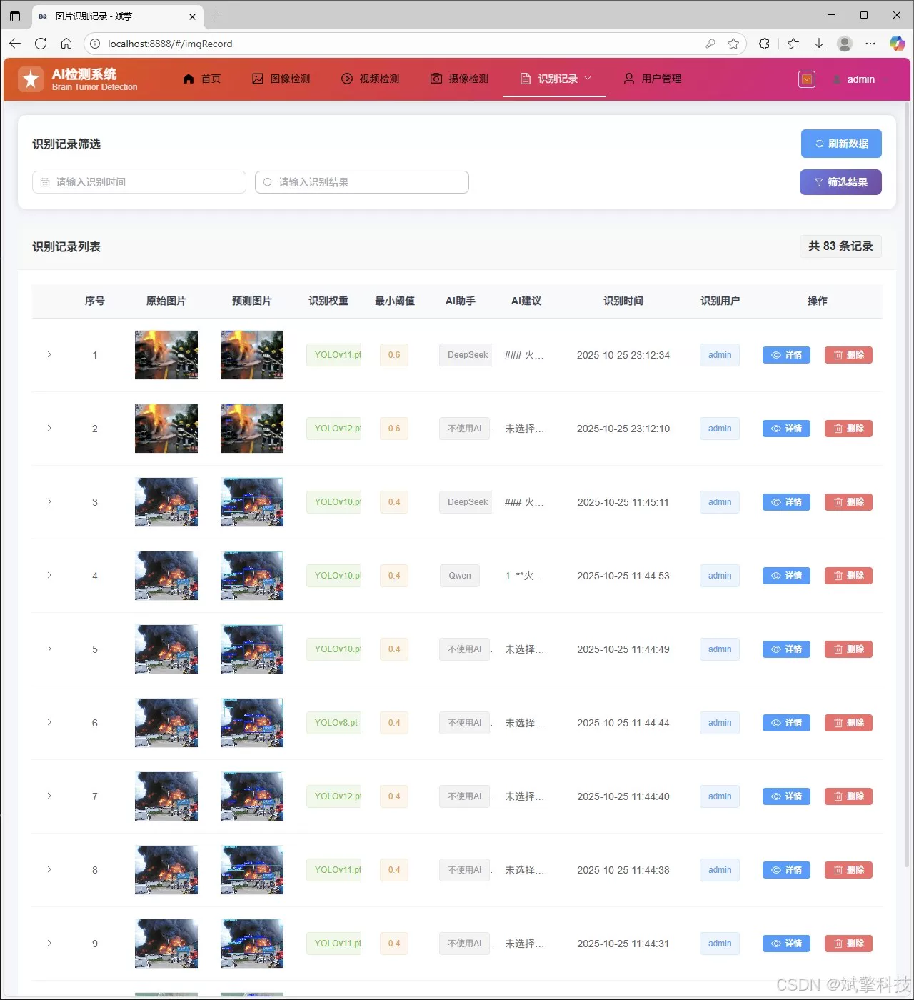
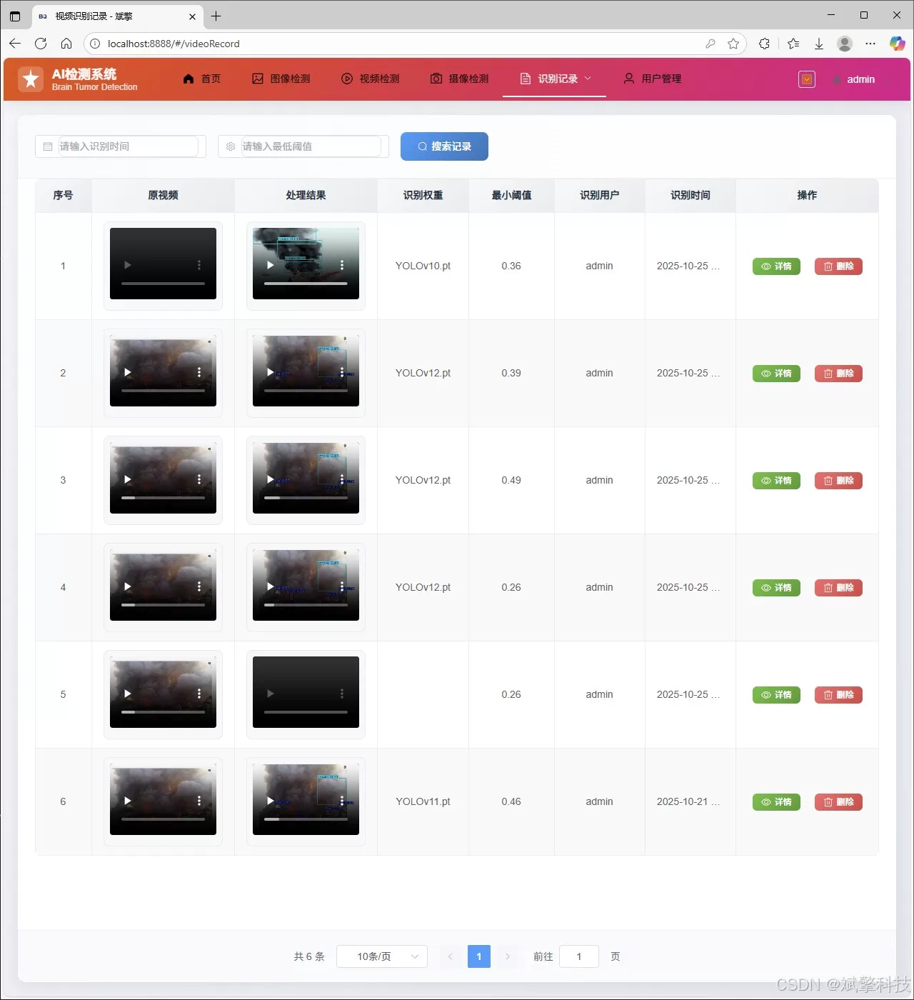
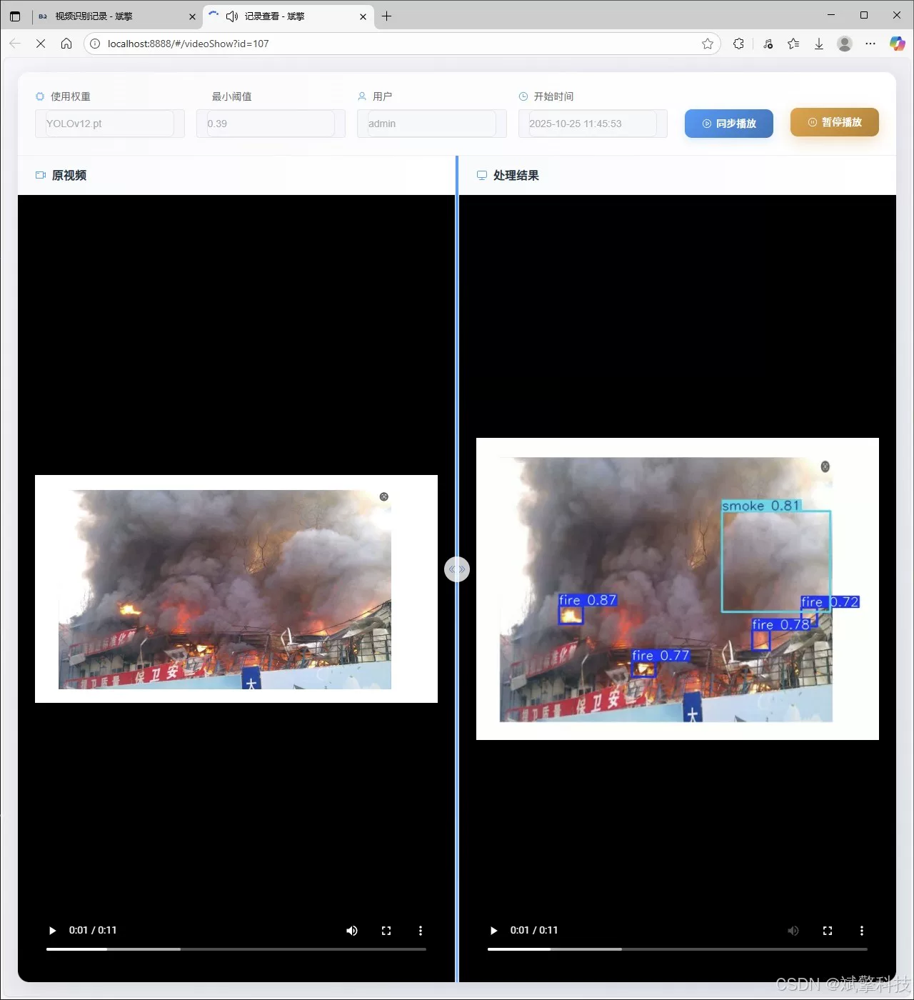
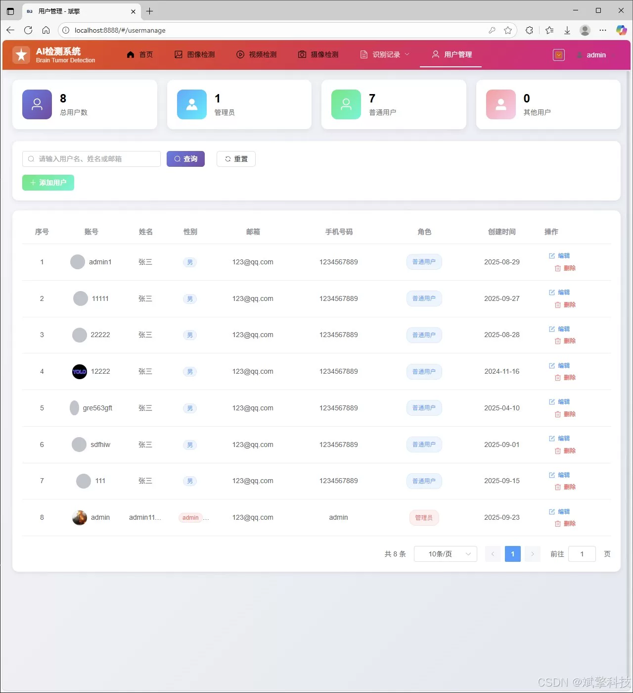

# DeepSeek+YOLO Fire Intelligent Detection

## Body

DeepSeek+YOLO Fire Intelligent Detection System Based on YOLO Deep Learning and the Large Models of Qianwen and DeepSeek (DeepSeek Intelligent Analysis + web interface interaction + front-end and back-end separation + YOLO data + YOLOv8/YOLOv10/YOLOv11/YOLOv12)

This paper designs and implements a web system for fire detection based on the YOLOv8/v10/v11/v12 algorithms and the SpringBoot framework, with a front-end and back-end separation. The system aims to achieve precise and real-time recognition of early fire characteristics—flame ('fire') and smoke ('smoke') through deep learning technology. The project uses its own dataset, containing 6,744 high-quality labeled images (4,832 training set, 1,000 validation set, 912 test set), ensuring the robustness of the model. The core of the system provides a comprehensive Web platform that integrates user management, real-time video stream detection, recognition result management, and visualization analysis. DeepSeek intelligent analysis provides preventive measures, effectively solving the problems of low efficiency and slow response in traditional monitoring, providing an efficient and feasible technical solution for modern smart firefighting.

Functional modules

✅ Information visualization, data visualization.

✅ Image detection supported by AI analysis functions, deepseek and Qianwen.

✅ Support for image detection, video detection, and real-time camera detection, with detection results saved to MySQL database.

✅ Record management for image recognition, video recognition, and camera recognition.

✅ User management module, where administrators can add, delete, update, and view users.

✅ Personal center, where users can modify their information, including passwords, names, and profile pictures.

## Images

## Payment

Here is a pay link on Stripe ( https://buy.stripe.com/3cs8yP7sY87d0vu9AB ). Please contact me lonlonago@foxmail.com after funding $89, and I will send you a complete data files , thank you!

